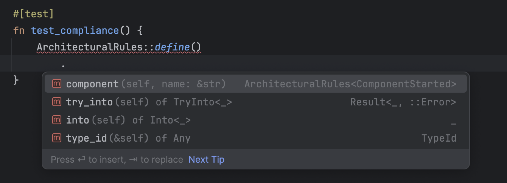

# 📐 Rust Arkitect

[](https://codecov.io/github/pfazzi/rust_arkitect)
[](https://crates.io/crates/rust_arkitect)
[](https://crates.io/crates/rust_arkitect)
[](https://crates.io/crates/rust_arkitect)

**Rust Arkitect** is a library inspired by [phparkitect/arkitect](https://github.com/phparkitect/arkitect), designed to define and validate architectural rules in Rust projects. By leveraging a simple, developer-friendly DSL, Rust Arkitect helps maintain clean architectures.

### Why It Matters
Architectural rules are essential for maintaining clean, modular, and scalable codebases. Rust Arkitect provides developers with the tools to:
- Clearly document architectural rules
- Consistently enforce rules across the codebase, preventing accidental violations
- Catch architectural issues early with immediate feedback during testing

By integrating directly with Rust’s testing framework, Rust Arkitect allows teams to ensure their architecture evolves safely as their codebase grows.

### Readable and Expressive
Rust Arkitect provides a developer-friendly DSL that simplifies defining and enforcing architectural rules.
The DSL is designed to be as close to plain English as possible, making it easy to understand even for those new to the project. For example:
```rust
let project = Project::from_relative_path(file!(), "./../src");

let rules = ArchitecturalRules::define()
    .component("Domain")
        .located_at("crate::domain")
        .allow_external_dependencies(&["std::fmt"])
        .must_not_depend_on_anything()
    .component("Application")
        .located_at("crate::application")
        .may_depend_on(&["Domain"])
    .finalize();
```
The DSL mirrors how developers naturally think about architecture, making it both clear and concise.

### Test-Driven Validation

The DSL integrates seamlessly with Rust’s testing framework, allowing you to assert compliance as part of your test suite:

```rust
let result = Arkitect::ensure_that(project).complies_with(rules);

assert!(result.is_ok());
```

### DSL with IDE Autocomplete Support

When using the DSL, your IDE provides suggestions as you type, guiding you through the available methods and their signatures: start typing `ArchitecturalRules`, and autocomplete will guide you!

<div style="text-align: center;">
    
</div>

### Built with Its Own Rules

Rust Arkitect is developed and tested using the same architectural rules it helps enforce. This approach ensures that the tool remains consistent with the principles it promotes. You can see the [architecture tests here](tests/test_architecture.rs).

## Example
Given a project with the following structure:

```plaintext
src/
├── application/
│   ├── mod.rs
│   └── service.rs
├── domain/
│   ├── mod.rs
│   ├── service.rs
│   └── entity.rs
├── infrastructure/
│   ├── mod.rs
│   ├── auth.rs
│   └── database.rs
```

You can define and test architectural rules:
```rust
use rust_arkitect::dsl::{ArchitecturalRules, Arkitect, Project};

#[test]
fn test_architectural_rules() {
    let project = Project::from_relative_path(file!(), "./../src");

    #[rustfmt::skip]
    let rules = ArchitecturalRules::define()
        .component("Application")
            .located_at("crate::application")
            .may_depend_on(&["Domain"])

        .component("Domain")
            .located_at("crate::domain")
            .allow_external_dependencies(&["std::fmt"])
            .must_not_depend_on_anything()

        .component("Infrastructure")
            .located_at("crate::infrastructure")
            .allow_external_dependencies(&["serde"])
            .may_depend_on(&["Domain", "Application"])

        .finalize();

    let result = Arkitect::ensure_that(project).complies_with(rules);

    assert!(
      result.is_ok(),
      "Detected {} violations",
      result.err().unwrap().len()
    );
}
```

## Using Rust Arkitect for Legacy Code Refactoring

In legacy codebases, refactoring can be risky without a way to monitor architectural changes. **`rust_arkitect`** enables you to implement a **fitness function** for your architecture by:
1. Measuring the current state of architectural violations
2. Defining a baseline to track improvements
3. Ensuring no new violations are introduced during refactoring

### Example Test with Baseline

Suppose your codebase has **30 violations**. Use the following test to monitor progress:

```rust
#[test]
fn test_architecture_baseline() {
    let rules = ArchitecturalRules::define()
        .component("business_logic")
            .located_at("crate::business_logic")
            .may_depend_on(&["crate::utils"])
        .component("utils")
            .located_at("crate::utils")
            .must_not_depend_on_anything()
        .finalize();

    let result = rust_arkitect::validate_rules("./src", rules);

    let baseline_violations = 30; // Current known violations

    match result {
        Ok(_) => panic!("Expected at least {} violations, but found none!", baseline_violations),
        Err(violations) => {
            let current_violations = violations.len();
            assert!(
                current_violations <= baseline_violations,
                "Violations increased! Expected at most {}, found {}.",
                baseline_violations,
                current_violations
            );
        }
    }
}
```

The test expects up to 30 violations. The number of violations must not exceed the baseline and should reduce over time.
This approach ensures incremental improvements while maintaining architectural consistency.

# How to log errors

Rust Arkitect includes logging support to provide detailed information during the validation process. This feature allows you to toggle between verbose and simple output by initializing the logger using Arkitect::init_logger().

### How to Enable Logging

To enable logging, simply call Arkitect::init_logger() at the start of your tests or application. For example:
```rust
use rust_arkitect::dsl::{ArchitecturalRules, Arkitect, Project};

#[test]
fn test_logging_in_architecture_rules() {
    // Initialize logging
    Arkitect::init_logger();

    let project = Project::from_relative_path(file!(), "./../src");

    let rules = ArchitecturalRules::define()
        .component("Application")
            .located_at("crate::application")
            .may_depend_on(&["Domain"])

        .component("Domain")
            .located_at("crate::domain")
            .must_not_depend_on_anything()
        .finalize();

    let result = Arkitect::ensure_that(project).complies_with(rules);

    assert!(result.is_ok());
}
```

### Controlling Verbosity

You can adjust the verbosity of the logging output by setting the RUST_LOG environment variable:
- Verbose Mode: Shows detailed information, including applied and respected rules:
```bash
RUST_LOG=error cargo test -- --nocapture
```
Example Output:
```plaintext
[2024-12-30T12:17:08Z ERROR rust_arkitect::dsl] 🟥 Rule crate::event_sourcing may depend on [std::fmt] violated: forbidden dependencies to [crate::domain::events::event] in file:///users/random/projects/acme_project/src/event_sourcing/events.rs
[2024-12-30T12:17:08Z ERROR rust_arkitect::dsl] 🟥 Rule crate::utils may not depend on any modules violated: forbidden dependencies to [crate::infrastructure::redis::*] in file:///users/random/projects/acme_project/src/utils/refill.rs
```

# Feedback

Rust Arkitect is a new library, and your feedback is invaluable to its growth.
If you have ideas, suggestions, or would like to contribute, open an issue or submit a pull request.